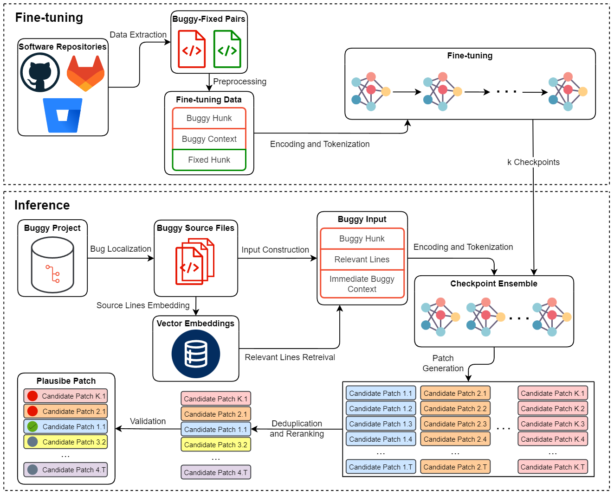

# MultiMend: Multilingual Program Repair with Context Augmentation and Multi-Hunk Patch Generation
[](https://arxiv.org/abs/2501.16044)
[](https://huggingface.co/collections/h4iku/multimend-6797f70ef386b10d16158d77)



## How to Use

1. Install Python 3.11 or higher and clone this repository with its submodules:

    ```bash
    git clone --recurse-submodules https://github.com/h4iku/MultiMend.git
    cd MultiMend
    ```

2. Create a virtual environment and install the dependencies:

    ```bash
    python -m venv .venv
    source .venv/bin/activate

    python -m pip install -U pip setuptools
    pip install -r requirements.txt
    ```

3. Prepare evaluation benchmarks:

    Place the evaluation benchmarks in the `benchmarks` directory. Appropriate version of repositories for [QuixBugs](https://github.com/jkoppel/QuixBugs), [Defects4J](https://github.com/rjust/defects4j/), and [BugAID](https://dl.acm.org/doi/abs/10.1145/2950290.2950308) are already there. QuixBugs needs [Gradle](https://gradle.org/) to work and Defects4J requires extra installation steps:

    ```bash
    cd benchmarks/Defects4J
    cpanm --installdeps .
    ./init.sh
    ```
    For further information, follow [Defects4J set up instructions](https://github.com/rjust/defects4j/tree/e85036c044320f11df22d3f23f248fdd4e99a41b#setting-up-defects4j).

    For the [Codeflaws](https://codeflaws.github.io/) benchmark, download [codeflaws.tar.gz](http://www.comp.nus.edu.sg/%7Erelease/codeflaws/codeflaws.tar.gz) archive and extract it in the `benchmarks/Codeflaws` directory.

4. To run each module, navigate to the root of the repository and execute the following command:

    ```bash
    python -m package.module
    ```

    For example, to run the `src/bugline_finders/quixbugs_python.py` module:

    ```bash
    python -m src.bugline_finders.quixbugs_python
    ```
